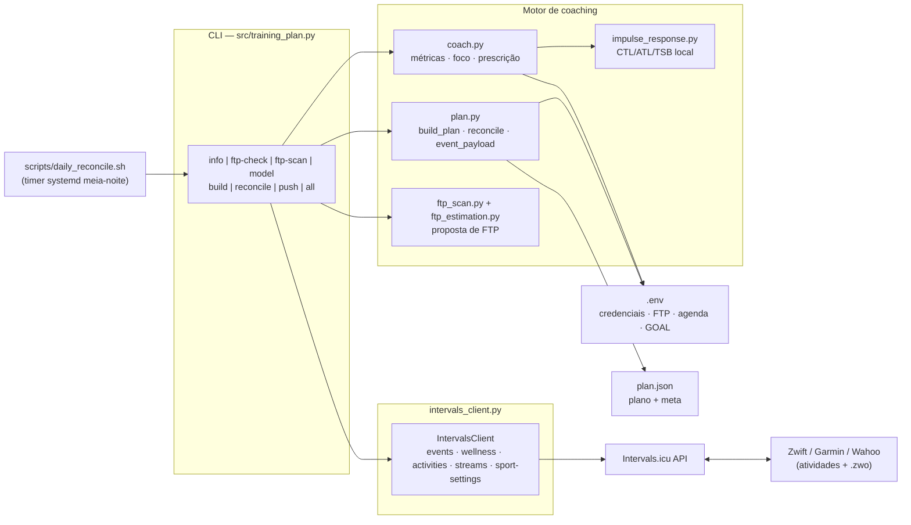
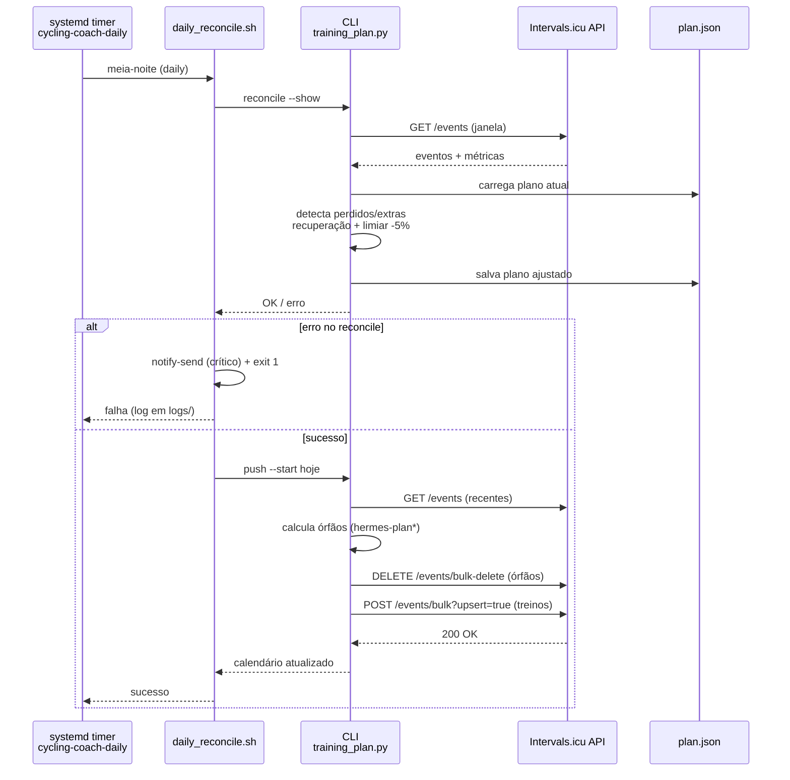
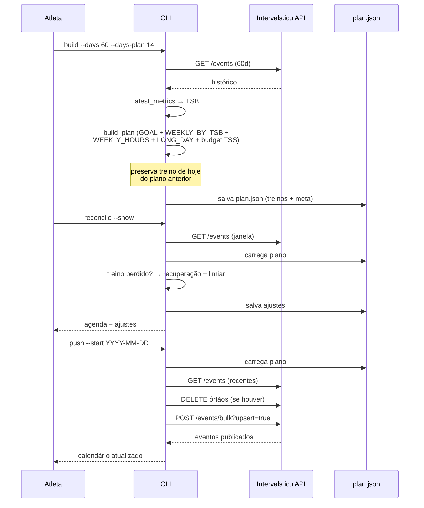
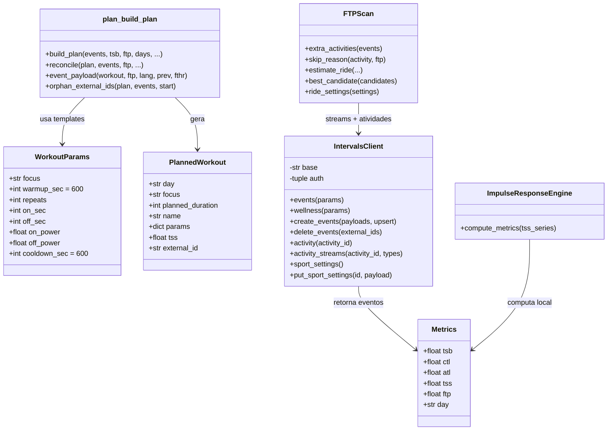
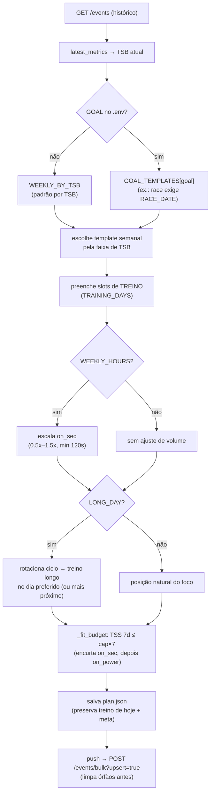
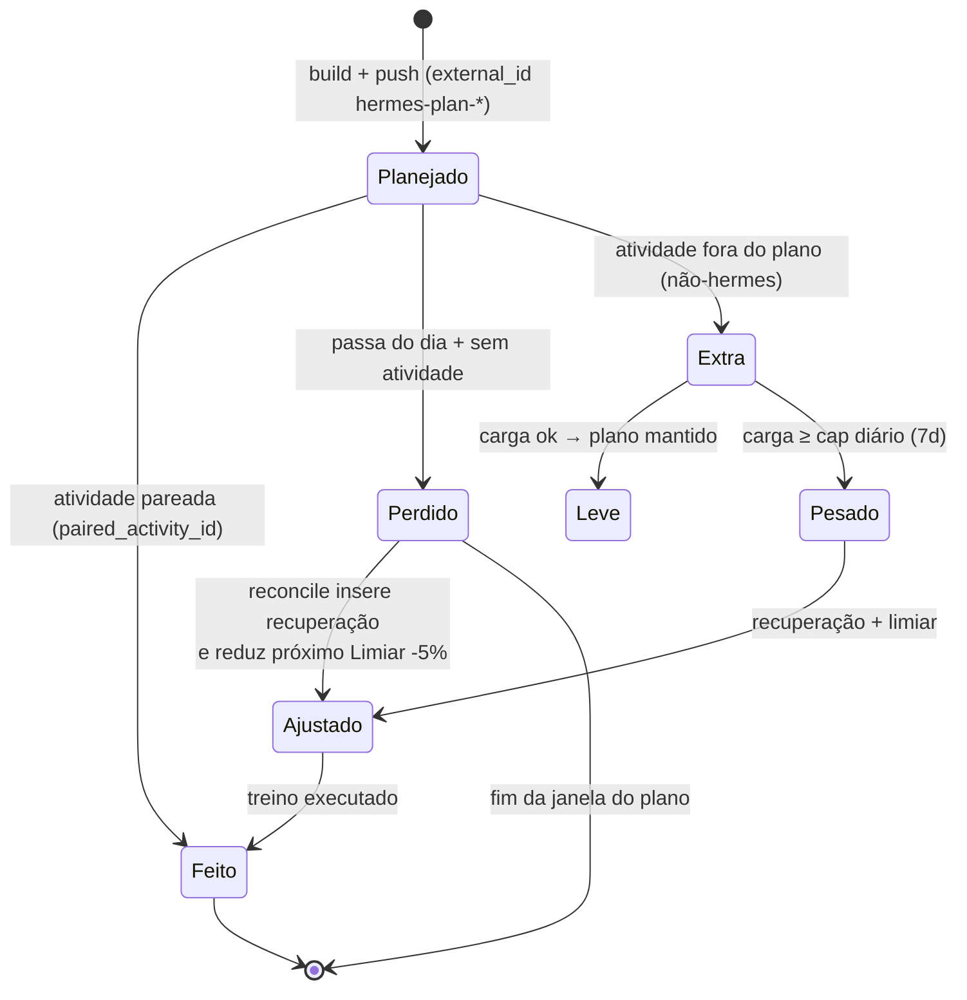

# Diagramas UML — Hermes Coach

Diagramas em [Mermaid](https://mermaid.js.org) do sistema real (v0.0.20).
Renderizam nativo no Obsidian (bloco ` ```mermaid `) e no GitHub.

Legenda rápida dos módulos:

| Módulo | Responsabilidade |
|---|---|
| `src/training_plan.py` | CLI: `info` / `ftp-check` / `ftp-scan` / `model` / `build` / `reconcile` / `push` / `all` |
| `src/coach.py` | Métricas (TSB/CTL/ATL), foco do dia, prescrição (`WorkoutParams`), TSS estimado |
| `src/plan.py` | Plano semanal (`build_plan`), ajuste por carga (`_fit_budget`), `reconcile`, texto do treino, `event_payload` |
| `src/impulse_response.py` | Motor Banister local (CTL/ATL/TSB) + séries diárias de TSS |
| `src/intervals_client.py` | Cliente da API do Intervals.icu (events, wellness, activities, streams, sport-settings) |
| `src/ftp_scan.py` / `ftp_estimation.py` | Análise de treinos fora do plano → proposta de FTP (20min × 0,95) |
| `plan.json` | Estado local do plano (treinos + meta: goal, race_date, ftp_candidates) |
| `scripts/daily_reconcile.sh` | Timer systemd: reconcile + push à meia-noite |

---

## 1. Diagrama de componentes (visão geral)



---

## 2. Sequência — fluxo diário automático (timer de meia-noite)



---

## 3. Sequência — ciclo manual (build → reconcile → push)



---

## 4. Diagrama de classes (entidades principais)



---

## 5. Diagrama de atividades — decisão de foco e geração do treino

Fluxo do `build`: do histórico ao plano publicado.



---

## 6. Diagrama de estados — ciclo de vida de um evento de treino



---

## Notas

- Diagramas gerados a partir do código real (`src/*.py`, v0.0.20, 216 testes OK) —
  não são genéricos. Se o código mudar, atualize aqui junto.
- O `.zwo` **não é gerado localmente** (o Intervals monta no app a partir do
  texto de `description`).
- `plan.json` guarda a meta (goal, race_date, ftp_test_date, ftp_candidates)
  além dos treinos — o `reconcile` reescreve os dias sem mudar o tamanho do plano.